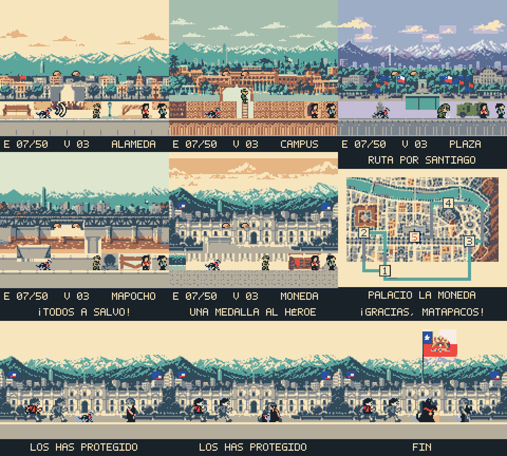

# Negro Matapacos

A Game Boy Color platformer about the Chilean street dog Negro Matapacos, built around helping students through the streets of Santiago. The intended runtime is GBDK-2020.

The project now includes a **playable GBC prototype** using the approved 16 x 16 sprites and eight-frame run cycle. Five horizontal stages run from Alameda through Campus, Plaza Dignidad and Río Mapocho to La Moneda. Movement, variable-height jumping, double-tap sprint, tile collisions, scrolling, police patrols, bark stuns, empanadas, checkpoints, lives, pause/retry, student rescue and sequential map unlocks are implemented. The final rescue leads to the medal ceremony and an animated presidential-standard raising.

Every fresh boot shows an English / Español selector before Start Game appears. Interface and dialogue follow the confirmed language; text embedded in world artwork stays Spanish. Progress and collected empanadas survive deaths and revisits during the session. Starting a new game resets progress and retains the chosen language. This prototype has no battery save.

## Build and play

The tested compiler is **GBDK-2020 4.5.0, Windows x64**. Place its extracted `gbdk` folder at the project root, set `GBDK_HOME` to that folder, or use the free project-local installer:

```powershell
powershell -ExecutionPolicy Bypass -File tools/setup-gbdk.ps1
node tools/build-rom.cjs
```

The build produces `build/matapacos.gbc`, a 256 KiB GBC-only MBC5 ROM, plus compiler/linker reports. It regenerates runtime banked resources from the retained art; no image service or paid API is called. Install the declared Sharp dependency with `npm install` if it is not already supplied by the Codex bundled runtime.

Open the ROM in a GBC emulator, or run the free local PyBoy window:

```powershell
powershell -ExecutionPolicy Bypass -File tools/setup-pyboy.ps1
powershell -ExecutionPolicy Bypass -File tools/run-game.ps1
```

The launcher uses an installed Python or the local Codex Python runtime. Emulator packages remain in `.tools/pyboy`; neither setup script changes global installations. Set `GAME_PYTHON` when using a different interpreter for the test runner.

| Game control | PyBoy keyboard |
| --- | --- |
| Move / choose a level | Arrow keys |
| A: confirm / jump; release early for a short jump | X |
| B: bark / menu back | Z |
| Start: begin / pause / resume | Enter |
| Sprint | Tap a direction twice, then hold it |

Bark near an officer to stun them. Jump onto an officer from above twice: the first stomp bounces Matapacos and marks the officer with a gold star, and the second removes them with a dust puff and an empanada prize. Stunned officers can still be stomped; active officers hurt Matapacos on side contact. Defeated officers and collected prizes stay cleared through deaths and level revisits during the session.

At the end of a stage, bark near the barricade or students from either side, then reach the students. Jumping over the barricade and facing away no longer prevents rescue. A checkpoint flag marks the respawn position. Fifty empanadas grant one life. The pause menu's B button returns to the world map; B on the map returns to the title.

Solid terrain uses saturated orange/gold bricks, bright top edges and dark outlines. The city ends above the platform area so distant buildings cannot hide jumpable surfaces. Mountains/sky scroll at one-quarter camera speed, the city at half speed and interactive terrain at full speed. Two LCD interrupts split the GBC background into bands at lines 48 and 80; each band streams its own tile columns. All collision-bearing art stays below the second split, and the HUD remains fixed. Every accepted bark plays a short square/noise sound; its noise channel stays audible over pickup/rescue tones.

## Source and verification

`platformer.c` contains the complete gameplay module: signed 12.4 physics, bounded edge collisions, camera streaming, fixed actor pools, sprite budgets, gameplay states and the `wait_vbl_done()` loop. `ui.c` holds banked menus; `generated/` holds reproducible banked art, terrain, precomputed visual columns and paired language strings. Modify level layouts in `tools/build-game-assets.cjs` and movement constants in `platformer.c`.

```powershell
node tools/test-game.cjs
```

The tests execute the actual ROM in PyBoy. Boundary tests arrange player/enemy RAM while paused and then exercise the compiled code. The route replay uses controller input to complete all five stages, unlock each next node and reach the ending. Tests cover input edges, both languages, wrapping, collisions, jump buffering/coyote time, sprint, pause, retries, bark blocking/stun recovery, two-stomp defeat and prize persistence, duplicate collectibles, the extra-life threshold, checkpoints, actual per-scanline parallax scroll values and tile/palette agreement across SCX wrap. A separate controller replay jumps over the closed barricade and rescues from beside the students. Audio checks sample the ROM's real sound output. Reports and emulator captures are written to `build/`, including `gameplay.gif` and `bark.wav`.

The tested five-stage controller replay runs one simulation update per emulated frame with no dropped gameplay frames, at most 40 OAM objects and a conservative cap of 10 objects per scanline. A run containing a death/load can observe two counter increments across an LCD-off transition; gameplay remains capped by VBlank. Timing has been checked in PyBoy, not on physical hardware.

This is an initial layout for playtesting. The Campus currently uses elevated platforms and a climbing patrol in a horizontal room; full vertical rooms, music, persistent saves and final difficulty balance remain later work. Horizontal band parallax is implemented; tall scenery crossing the splits or vertical rooms will need a different band layout.

## Art

- [Art review gallery](assets/review.html)
- [Expanded overview image](assets/previews/expanded-overview.png)
- [Art inventory, budgets, and rebuild instructions](assets/README.md)
- [Game design and implementation plan](PLAN.md)



Native assets live in `assets/native/`. Generated C arrays and 2bpp patterns live in `assets/gbdk/`. The asset compiler is `tools/build-art.cjs`; run it with `npm run art:build` after installing the declared local dependency, or use the bundled runtime described in the art documentation.
